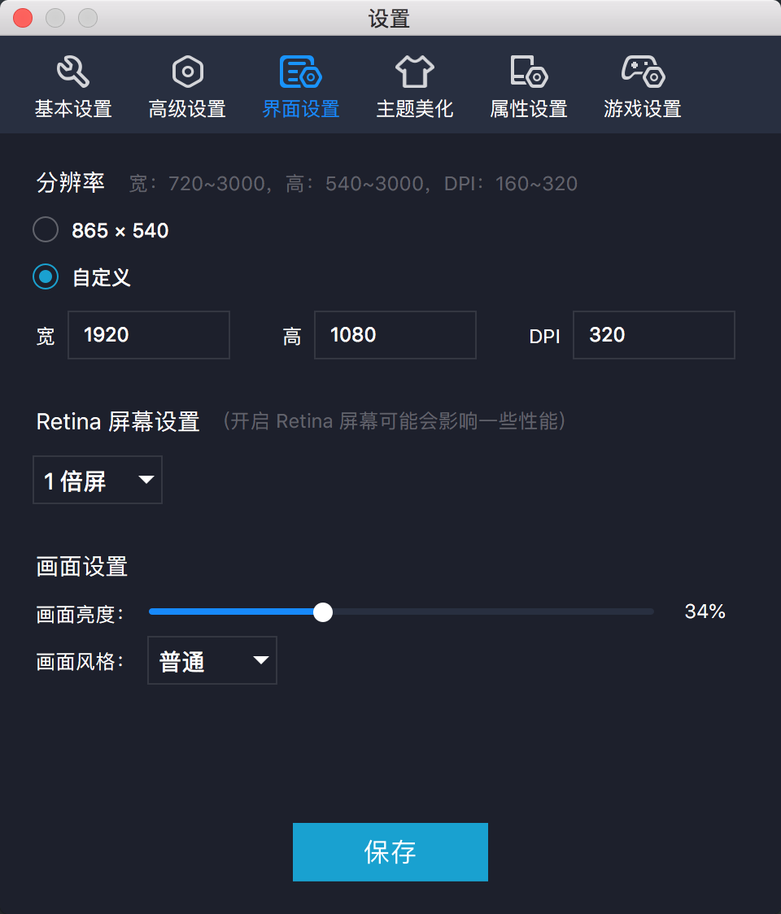

# 技术强国

富强、民主、文明、和谐；自由、平等、公正、法治；爱国、敬业、诚信、友善

视频12分 + 文章12分 + 评论2分 + 分享1分 + 收藏1分 + 登录1分 = 29分

~~python3 index.py~~

## 个人娱乐项目请勿传播及用于商业用途！


## 注意： 使用headlesschrome的index.py已经不能加分了, 改用安卓端的adb.py
1. 依赖:    
- osx(win不知道能不能用) 
- python3
- adb 
- 网易mumu模拟器(需安装并使用[ADBKey](https://github.com/senzhk/ADBKeyBoard), 用于提交评论)
  - 下载安装mumu模拟器
  - 在模拟器里安装“学习强国”APP
  - 打开mumu模拟器偏好设置，将分辨率调整为1920*1080
  - [参考文档](https://blog.csdn.net/slimboy123/article/details/54140029),大概就是安装ADBKey.apk,然后调整当前输入法为adbkeyboard  
  - 设置效果图与预览效果图如下：  
    
    

2. 使用:
- 打开xxqgAPP，登录
- ``python3 adb.py``

#### 当出现 ``` error: no devices/emulators found ```时
``` 
adb kill-server   
adb start-server
adb remount 
``` 
